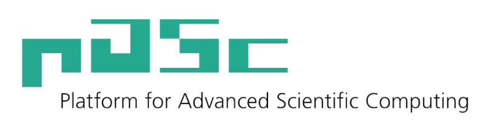

..
    Copyright (c) 2023 ETH Zurich

    SPDX-License-Identifier: BSL-1.0
    Distributed under the Boost Software License, Version 1.0. (See accompanying
    file LICENSE_1_0.txt or copy at http://www.boost.org/LICENSE_1_0.txt)

========
Overview
========

**pika** is a C++ library that builds on the `std::execution (P2300) proposal
<https://wg21.link/p2300>`__ by providing a CPU runtime with user-level threads, as well as
integration with CUDA, HIP, and MPI. See :ref:`getting_started` to get started.

Hello, world
============

Below is a brief overview of what you can do with pika. The majority of the functionality below
comes from ``std::execution``. pika adds a high-performance CPU runtime as well as a `std::execution
scheduler
<https://www.open-std.org/jtc1/sc22/wg21/docs/papers/2023/p2300r7.html#design-schedulers>`__ to
target the pika runtime. The stdexec repository contains `an excellent list of resources for
learning more about std::execution <https://github.com/NVIDIA/stdexec#resources>`__ itself.

.. literalinclude:: ../examples/documentation/hello_world_documentation.cpp
   :language: c++
   :start-at: #include

The example above should output something like:

.. code-block:: bash

   Hello from a pika user-level thread (with id 0x7fec6000c040)!
   x = 42
   Is this pi: 3.14?
   The result is 785942.2826

Getting help
============

Please report issues on `GitHub <https://github.com/pika-org/pika/issues>`__. General questions can
be asked on `GitHub discussions <https://github.com/pika-org/pika/discussions>`__.

Users of pika
=============

pika is used in `DLA-Future <https://github.com/eth-cscs/DLA-Future>`__, a distributed linear algebra
library used in high-performance computing applications.

If you or a project you know is using pika, let us know with an issue or pull request.

Acknowledgements
================

pika is a fork of `HPX <https://hpx.stellar-group.org>`__ focusing on the single-node use case
complemented by minimal MPI support. pika would not exist without all the hard work that has gone
into HPX.

The development of pika has been funded by:

.. image:: _static/logo-cscs.jpg
   :width: 50%
   :align: center
   :alt: Swiss National Supercomputing Centre (CSCS)
   :target: https://www.cscs.ch

.. image:: _static/logo-ethz.svg
   :width: 50%
   :align: center
   :alt: ETH Zurich
   :target: https://www.ethz.ch

Name
====

Pick your favourite meaning from the following:

* `pika the animal <https://en.wikipedia.org/wiki/Pika>`__
* `pika- as a prefix for fast in Finnish
  <https://en.wiktionary.org/wiki/pika->`__
* `pika in various other languages <https://en.wiktionary.org/wiki/pika>`__

.. toctree::
   :maxdepth: 1
   :hidden:

   usage
   api
   changelog
   developer
